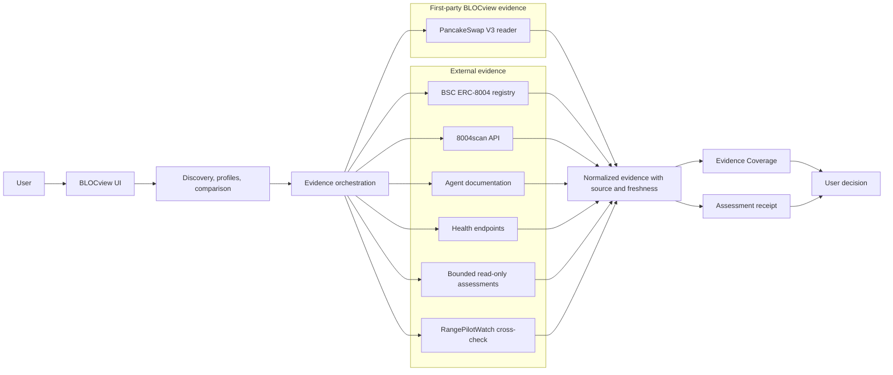
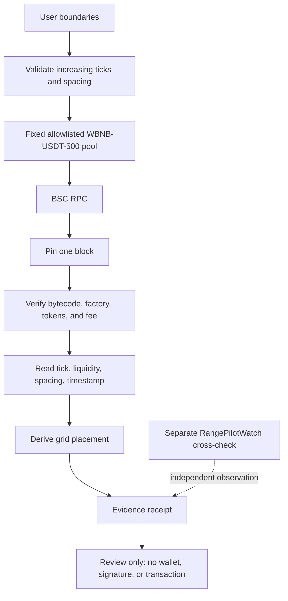

# BLOCview architecture

BLOCview separates first-party observation from external evidence and carries provenance into the result. Using a source does not mean treating it as trusted or complete.

Hiring uses fixed BLOCview server routes that validate one of four canonical inputs, call the allowlisted RangePilotWatch origin with a server-only `BLOCVIEW_SERVICE_TOKEN`, sanitize responses, and expose only durable task creation and retrieval. The browser never receives the credential or chooses an upstream URL.

## System architecture

Evidence orchestration obtains only supported evidence, normalizes without inventing fields, and keeps first-party and external observations distinct. Coverage reports availability; receipts report what was observed and where it came from.

## GridBand evidence flow

The server rejects identity mismatches, missing code, malformed critical state, or unavailable required getters. Large integers remain exact strings where needed. RangePilotWatch may add a separately identified cross-check; it never substitutes for the first-party observation.

No wallet, signature, approval, arbitrary RPC/address/ABI/calldata, swap, liquidity modification, payment, or transaction path exists.

## Trust and evidence boundary

| Boundary | BLOCview controls | External to BLOCview |
| --- | --- | --- |
| Product | UI, allowlists, validation, normalization, coverage, receipts | User decisions after review |
| First-party observation | Pool identity checks, pinned reads, placement derivation | BSC node availability and contracts |
| Indexed evidence | Server adapter and truthful display | 8004scan indexing, availability, correctness |
| Agent evidence | Supported shapes and source labels | Registration metadata, docs, health, assessment services |
| Cross-check | Separation from first-party evidence | RangePilotWatch availability and timing |

External evidence is evidence to inspect, not endorsement. Coverage measures presence, not truth, quality, safety, profitability, or suitability.
