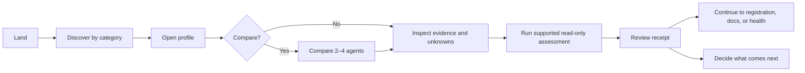
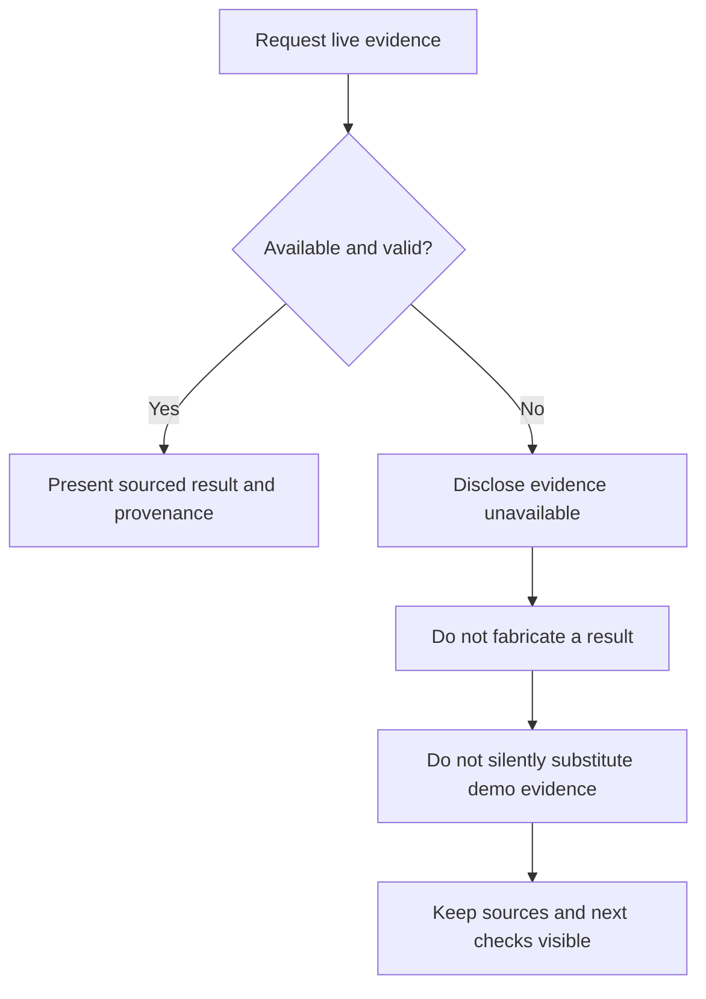

# BLOCview user journey

## Main journey

Purpose comes first, followed by identity, evidence, controls, freshness, and gaps. Comparison preserves differences instead of producing a ranking. BLOCview ends at the evidence checkpoint, before wallet permission, payment, or execution.

## Graceful evidence failure

An unavailable RPC or endpoint, malformed response, or failed identity check produces an explicit unavailable state. Demo records remain separate and labelled; they are never live fallback evidence.
